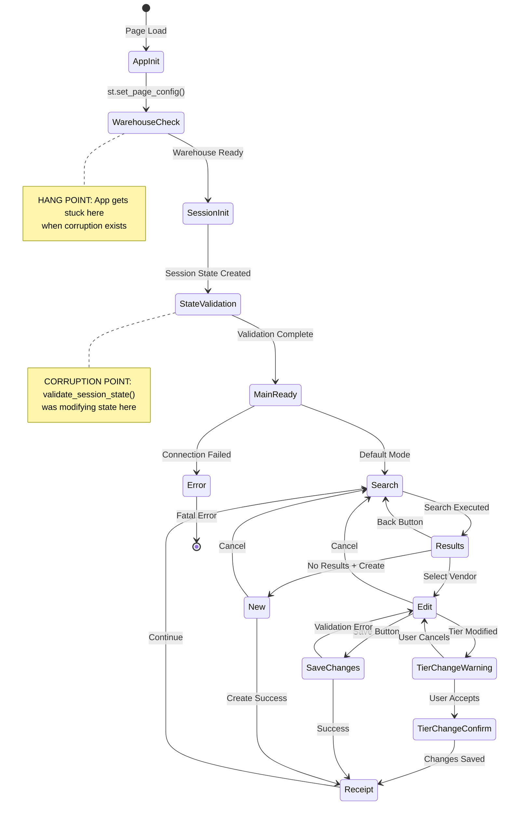

# CPFR VC App State Machine Documentation

## Visual State Diagram



## State Definitions

| State ID | Display Name | Session Variables | Valid Transitions | Description |
|----------|-------------|-------------------|-------------------|-------------|
| `AppInit` | App Initialization | None | `WarehouseCheck` | Initial app load, before any Streamlit code |
| `WarehouseCheck` | Checking Warehouse | None | `SessionInit`, `Error` | "Step 1 of 6" - Snowflake checking warehouse status |
| `SessionInit` | Session Initialization | All vars initializing | `StateValidation` | Module-level state initialization |
| `StateValidation` | State Validation | All vars initialized | `MainReady`, `Error` | Optional validation step (REMOVED in fix) |
| `MainReady` | Main App Ready | `current_mode='search'` | `Search` | App ready for user interaction |
| `Search` | Search Screen | `current_mode='search'` | `Results`, `New` | Vendor search interface |
| `Results` | Search Results | `search_results != None` | `Search`, `Edit`, `New` | Displaying search results |
| `Edit` | Edit Vendor | `current_mode='edit'`, `selected_vendor != None` | `Search`, `SaveChanges`, `TierChangeWarning` | Editing existing vendor |
| `New` | Create Vendor | `current_mode='new'` | `Search`, `Receipt` | Creating new vendor |
| `TierChangeWarning` | Tier Change Warning | `tier_change_state='warning'` | `TierChangeConfirm`, `Edit` | Warning about tier change impacts |
| `TierChangeConfirm` | Tier Change Confirmation | `tier_change_state='confirmation'` | `Receipt`, `Edit` | Confirming tier change |
| `SaveChanges` | Saving Changes | `pending_changes != None` | `Receipt`, `Edit` | Processing save operation |
| `Receipt` | Change Receipt | `current_mode='receipt'` | `Search` | Displaying operation results |
| `Error` | Error State | Various | `[*]` (Terminal) | Fatal error requiring reload |

## State Transition Rules

### Initialization Sequence (CRITICAL PATH)
```
[*] → AppInit → WarehouseCheck → SessionInit → StateValidation → MainReady → Search
```

**CORRUPTION OCCURS WHEN:**
- State modification happens during `StateValidation`
- Session state is altered between `WarehouseCheck` and `MainReady`
- `st.rerun()` is called before `MainReady`

### User Interaction States
```yaml
Search:
  triggers:
    - search_button_click
    - search_value_change
  transitions:
    to_results:
      condition: search_results.found == true
      sets:
        - search_results = data
        - search_performed = true
    to_new:
      condition: search_results.found == false && create_button_click
      sets:
        - current_mode = 'new'
        - selected_vendor = template

Edit:
  triggers:
    - edit_button_click
    - field_change
  transitions:
    to_tier_warning:
      condition: tier_changed == true
      sets:
        - tier_change_state = 'warning'
        - tier_change_warning = message
    to_save:
      condition: save_button_click && valid_data
      sets:
        - pending_changes = changes_dict
    to_search:
      condition: cancel_button_click
      sets:
        - current_mode = 'search'
        - selected_vendor = None
```

## Session State Variables Mapping

| Variable | Type | Init Value | Modified In States | Read In States | Corruption Risk |
|----------|------|------------|-------------------|----------------|-----------------|
| `db_manager` | DatabaseManager | `DatabaseManager()` | `SessionInit` | All states | HIGH - Early init |
| `vendor_processor` | VendorProcessor | `VendorProcessor()` | `SessionInit` | Search, Edit, New | LOW |
| `current_mode` | str | `'search'` | Edit, New, Receipt | All states | MEDIUM |
| `search_results` | dict/None | `None` | Results | Results, Edit | LOW |
| `selected_vendor` | dict/None | `None` | Results, Edit | Edit, SaveChanges | MEDIUM |
| `search_type` | str | `'Vendor Number'` | Search | Search | LOW |
| `search_value` | str | `''` | Search | Search, Results | LOW |
| `tier_change_state` | str/None | `None` | TierChangeWarning | TierChange states | MEDIUM |
| `tier_change_warning` | str/None | `None` | TierChangeWarning | TierChangeWarning | LOW |
| `tier_change_receipt` | dict/None | `None` | Receipt | Receipt | LOW |
| `search_performed` | bool | `False` | Search, Results | Search | LOW |
| `pending_changes` | dict/None | `None` | Edit | SaveChanges | HIGH - Validation target |
| `original_vendor` | dict/None | `None` | Edit | SaveChanges | HIGH - Validation target |
| `file_changing` | bool | `False` | Edit | Edit, SaveChanges | MEDIUM |

## Corruption Detection Rules

```python
# These conditions indicate corruption:
CORRUPTION_INDICATORS = {
    "stuck_at_warehouse": {
        "symptom": "App hangs at 'Step 1 of 6'",
        "cause": "State modified during WarehouseCheck",
        "fix": "Remove early state modifications"
    },
    "inconsistent_edit": {
        "symptom": "Edit mode without selected_vendor",
        "cause": "State validation false positive",
        "fix": "Don't validate during init"
    },
    "orphaned_changes": {
        "symptom": "pending_changes without original_vendor",
        "cause": "Partial state update",
        "fix": "Atomic state updates only"
    }
}
```

## Safe State Transition Patterns

### SAFE: User-Triggered Transitions
```python
# State changes in response to user action
if st.button("Edit Vendor"):
    st.session_state.current_mode = 'edit'
    st.session_state.selected_vendor = vendor_data
    st.rerun()  # Safe - user triggered
```

### UNSAFE: Init-Time Transitions
```python
# NEVER do this during initialization
def main():
    st.set_page_config(...)
    # UNSAFE - modifying state during init
    if st.session_state.current_mode == 'invalid':
        st.session_state.current_mode = 'search'  # CORRUPTION RISK
```

### SAFE: Atomic Updates
```python
# Update related states together
def transition_to_edit(vendor):
    # Atomic update - all or nothing
    st.session_state.current_mode = 'edit'
    st.session_state.selected_vendor = vendor
    st.session_state.original_vendor = vendor.copy()
    st.session_state.pending_changes = {}
    st.rerun()
```

## State Machine Validation Script

Save this as `validate_state.py`:

```python
"""
State Machine Validator for CPFR VC App
Run this to check for state corruption
"""

import streamlit as st
import json
from datetime import datetime

# Expected state configurations
VALID_STATES = {
    'search': {
        'current_mode': 'search',
        'selected_vendor': None,
        'required': ['db_manager', 'vendor_processor']
    },
    'edit': {
        'current_mode': 'edit',
        'selected_vendor': not None,  # Must have value
        'original_vendor': not None,
        'required': ['db_manager', 'vendor_processor']
    },
    'new': {
        'current_mode': 'new',
        'required': ['db_manager', 'vendor_processor']
    },
    'receipt': {
        'current_mode': 'receipt',
        'tier_change_receipt': not None,
        'required': ['db_manager']
    }
}

def validate_current_state():
    """Check if current session state is valid"""

    issues = []
    current_mode = st.session_state.get('current_mode', 'MISSING')

    # Check if mode is valid
    if current_mode not in VALID_STATES:
        issues.append(f"Invalid mode: {current_mode}")
        return issues

    # Check expected values for current mode
    expected = VALID_STATES[current_mode]

    for key, expected_value in expected.items():
        if key == 'required':
            for req_key in expected_value:
                if req_key not in st.session_state:
                    issues.append(f"Missing required: {req_key}")
                elif st.session_state[req_key] is None:
                    issues.append(f"Required key is None: {req_key}")
        else:
            actual_value = st.session_state.get(key, 'MISSING')
            if expected_value is not None:
                if actual_value != expected_value:
                    issues.append(f"{key}: expected={expected_value}, actual={actual_value}")
            else:
                # expected_value is "not None" check
                if actual_value is None:
                    issues.append(f"{key} should not be None in {current_mode} mode")

    # Check for corruption patterns
    if st.session_state.get('pending_changes') and not st.session_state.get('original_vendor'):
        issues.append("CORRUPTION: pending_changes without original_vendor")

    if current_mode == 'edit' and not st.session_state.get('selected_vendor'):
        issues.append("CORRUPTION: edit mode without selected_vendor")

    return issues

def generate_state_report():
    """Generate a state machine health report"""

    report = {
        "timestamp": datetime.now().isoformat(),
        "current_mode": st.session_state.get('current_mode', 'UNKNOWN'),
        "session_keys": list(st.session_state.keys()),
        "validation_issues": validate_current_state(),
        "state_snapshot": {}
    }

    # Capture non-sensitive state
    for key in st.session_state:
        if key not in ['db_manager', 'vendor_processor']:  # Skip objects
            value = st.session_state[key]
            if value is None:
                report["state_snapshot"][key] = "None"
            elif isinstance(value, (str, int, float, bool)):
                report["state_snapshot"][key] = value
            elif isinstance(value, (dict, list)):
                report["state_snapshot"][key] = f"{type(value).__name__}(len={len(value)})"
            else:
                report["state_snapshot"][key] = type(value).__name__

    return report

# If running standalone
if __name__ == "__main__":
    st.title("State Machine Validator")

    if st.button("Validate Current State"):
        report = generate_state_report()

        if report["validation_issues"]:
            st.error(f"Found {len(report['validation_issues'])} issues:")
            for issue in report["validation_issues"]:
                st.warning(f"- {issue}")
        else:
            st.success("State machine is valid!")

        with st.expander("Full State Report"):
            st.json(report)
```

## Integration with Main App

Add this to your main app for continuous monitoring:

```python
# In streamlit_app.py, add after imports:
from validate_state import validate_current_state

# In main(), add debug mode:
if st.sidebar.checkbox("🔍 Debug Mode", value=False):
    issues = validate_current_state()
    if issues:
        st.sidebar.error(f"State Issues: {len(issues)}")
        for issue in issues:
            st.sidebar.warning(issue)
    else:
        st.sidebar.success("State: Valid")
```

## Maintenance Guidelines

1. **When Adding New States**: Update this document's state diagram and tables
2. **When Changing Transitions**: Verify against corruption rules
3. **After Each Fix**: Run state validator to ensure consistency
4. **For New Features**: Map state changes before implementing

## Quick Reference Card

```
NEVER:
- Modify state during init (before MainReady)
- Call validate_session_state() in main()
- Use st.rerun() before user interaction
- Trust state during WarehouseCheck

ALWAYS:
- Match ReferenceApp patterns
- Update states atomically
- Validate in user handlers only
- Document new states here
```